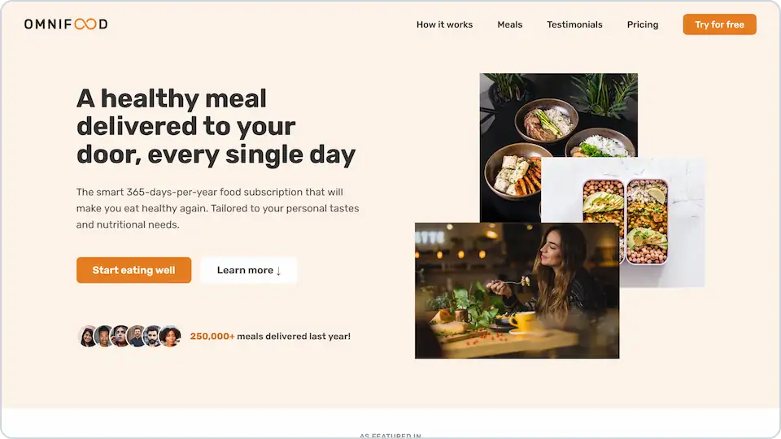
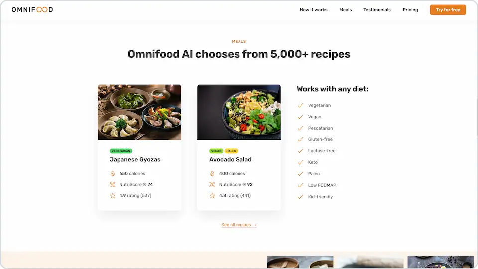

# 

**Home page for a fictional AI-powered food subscription service.**

## 💻 Screenshots

## 🛠️ Tools and technologies
`HTML` `CSS` `JavaScript` `Parcel` `npm` `Netlify`

In the project I used among others:
- Flex box
- CSS grid
- Media queries
- JS intersection observer
- Parcel as a build tool

## 🌐 Deployment
Deployed on `Netlify`.

Live preview at [dawidlehai-omnifood.netlify.app](https://dawidlehai-omnifood.netlify.app/).

## 🎓 Related course
This project was created as a part of the [Udemy](https://www.udemy.com/ "Udemy") course [_Build Responsive Real-World Websites with HTML and CSS_](https://www.udemy.com/course/design-and-develop-a-killer-website-with-html5-and-css3/) by [Jonas Schmedtmann](https://twitter.com/jonasschmedtman "Jonas Schmedtmann on Twitter").
